# Multi-Agent AI Document Processing System

# here is the working video demo: https://www.loom.com/share/519f3b55f959414f8472df913557ebaf?sid=219c4967-8a69-4f9e-b244-c80c3ebbcfda
A sophisticated multi-agent system for intelligent document processing using LangChain, supporting multiple AI models (OpenAI, Anthropic, DeepSeek) with Redis-based memory management.

## 🚀 Quick Start

```bash
# Install dependencies
run **uv sync** to install all the dependencies and activate environment

# Set environment variables
export DEEPSEEK_API_KEY="your_deepseek_api_key"
export OPENAI_API_KEY="your_openai_api_key"  # Optional
export ANTHROPIC_API_KEY="your_anthropic_api_key"  # Optional
export REDIS_URL="redis://localhost:6379" 

# Start Redis (if running locally)
redis-server

# Run the application
python app.py
```

## 📋 Table of Contents

- [A. System Architecture](#a-system-architecture)
- [B. Agent Flow](#b-agent-flow)
- [C. Supported Models](#c-supported-models)
- [D. Document Types](#d-document-types)
- [E. API Endpoints](#e-api-endpoints)
- [F. Memory System](#f-memory-system)
- [G. PDF Processing](#g-pdf-processing)
- [H. Agent Specifications](#h-agent-specifications)
- [I. Classification Logic](#i-classification-logic)
- [J. Error Handling](#j-error-handling)
- [K. Usage Examples](#k-usage-examples)
- [L. Configuration](#l-configuration)
- [M. Testing](#m-testing)
- [N. Deployment](#n-deployment)
- [O. Monitoring](#o-monitoring)
- [P. Troubleshooting](#p-troubleshooting)

## A. System Architecture

```mermaid
graph TB
    A[Client Request] --> B[FastAPI App]
    B --> C[AgentOrchestrator]
    C --> D[ClassifierAgent]
    D --> E{Classification Result}
    E -->|Invoice/RFQ| F[JSONAgent]
    E -->|Email/Complaint| G[EmailAgent]
    F --> H[Memory Storage]
    G --> H
    H --> I[Redis Cache]
    
    subgraph "AI Models"
        J[DeepSeek]
        K[OpenAI GPT]
        L[Anthropic Claude]
    end
    
    D --> J
    F --> K
    G --> L
```



The system follows a **multi-agent architecture** with:
- **FastAPI** as the framework
- **AgentOrchestrator** for coordination
- **Specialized agents** for different document types
- **Redis** for persistent memory storage
- **Multiple AI models** for processing flexibility

## B. Agent Flow

### Step-by-Step Processing Flow:

1. **Document Ingestion**
   - Text content via `/process/text`
   - File upload via `/process/file` (PDF, JSON, email files)
   - PDF extraction using PyPDF2

2. **Classification Phase**
   - `ClassifierAgent` analyzes content structure and intent
   - Determines format: `pdf`, `json`, `email`
   - Identifies intent: `invoice`, `rfq`, `complaint`, `regulation`, `general`
   - Routes to appropriate specialized agent

3. **Specialized Processing**
   - **JSONAgent**: Validates JSON, extracts structured data, identifies anomalies
   - **EmailAgent**: Extracts sender info, determines urgency, analyzes sentiment

4. **Memory Storage**
   - All processing results stored in Redis
   - Indexed by type, intent, and timestamp
   - Retrievable for context and history

5. **Response Generation**
   - Structured response with processing results
   - Memory ID for future reference
   - Success/error status with detailed messages

## C. Supported Models

### Model Support Matrix:

| Provider | Models | Use Cases |
|----------|--------|-----------|
| **DeepSeek** | `deepseek-chat`, `deepseek-reason` | Default, cost-effective |
| **OpenAI** | `gpt-4o`, `gpt-4o-mini`, `gpt-3.5-turbo`, `o1`, `o1-preview` | High accuracy, complex reasoning |
| **Anthropic** | `claude-3-5-sonnet-latest`, `claude-3-5-haiku-latest` | Long context, safety |

### Model Selection:
```python
# Request with specific model
{
    "content": "Your document content",
    "model_id": "gpt-4o"  # or claude-3-5-sonnet-latest, deepseek-chat
}
```

## D. Document Types

### Supported Formats:
- **PDF**: Automatically extracted using PyPDF2
- **JSON**: Structured data validation and processing  
- **Email**: Communication analysis and CRM integration
- **Plain Text**: Auto-classified based on content

### Document Intents:
- **Invoice**: Billing documents, payment processing
- **RFQ**: Request for quote, procurement documents
- **Complaint**: Customer issues, urgent matters
- **Regulation**: Compliance documents, policies
- **General**: Fallback for other content types

## E. API Endpoints

### Core Endpoints:

#### `POST /process/text`
Process text content directly.

**Request:**
```json
{
    "content": "Your text content here",
    "metadata": {"optional": "metadata"},
    "model_id": "deepseek-chat"
}
```

#### `POST /process/file`
Upload and process files (PDF, JSON, email).

**Form Data:**
- `file`: File to upload
- `metadata`: Optional JSON metadata string
- `model_id`: Model to use for processing

#### `GET /history?limit=10`
Retrieve recent processing history.

#### `GET /memory/{memory_id}`
Get specific memory entry details.

#### `POST /classify`
Classify content without full processing.

#### `GET /health`
System health check with component status.

## F. Memory System

### Memory Architecture:
- **Redis-based**: Persistent storage across sessions
- **Indexed**: By type, intent, thread, conversation
- **TTL**: 30-day expiration for automatic cleanup
- **Structured**: Pydantic models for type safety

### Memory Entry Structure:
```python
{
    "id": "uuid",
    "source": "agent_name",
    "document_type": "pdf|json|email",
    "intent": "invoice|rfq|complaint|regulation|general",
    "extracted_values": {...},
    "timestamp": "ISO datetime",
    "thread_id": "optional",
    "conversation_id": "optional"
}
```

### Memory Access Methods:
- `get_entries_by_type()`: Filter by document format
- `get_entries_by_thread()`: Conversation context
- `get_recent_context()`: Latest processing results
- `store_entry()`: Save new memory

## G. PDF Processing

### PDF Extraction Pipeline:
1. **Content Validation**: Verify PDF format using PyPDF2
2. **Text Extraction**: Page-by-page text extraction
3. **Metadata Extraction**: Document properties, creation date, author
4. **Error Handling**: Graceful handling of corrupted/encrypted PDFs
5. **Classification**: Extracted text sent to classifier for routing

### PDF Processing Features:
- **Multi-page Support**: Processes all pages with page markers
- **Metadata Preservation**: Extracts PDF metadata for context
- **Error Recovery**: Continues processing even if some pages fail
- **Format Detection**: Automatic PDF detection by content type and extension

## H. Agent Specifications

### ClassifierAgent
**Purpose**: Content analysis and routing
**Input**: Raw document content
**Output**: Format classification, intent detection, routing decision
**Routing Logic**: Intent-based (not format-based)
- Invoice/RFQ → JSONAgent (structured data)
- Complaint/Regulation/General → EmailAgent (communication)

### JSONAgent  
**Purpose**: Structured data processing
**Capabilities**:
- JSON validation and parsing
- Missing field detection
- Data anomaly identification
- Reformatting and cleaning
- Business logic validation

### EmailAgent
**Purpose**: Communication processing
**Capabilities**:
- Sender extraction and validation
- Urgency level determination
- Sentiment analysis
- CRM-ready summarization
- Contact information extraction

## I. Classification Logic

### Classification Process:
1. **Content Analysis**: Examine structure and keywords
2. **Format Detection**: JSON syntax, email headers, PDF indicators
3. **Intent Recognition**: Business context and purpose
4. **Confidence Scoring**: Reliability measure (0.0-1.0)
5. **Routing Decision**: Target agent selection

### Classification Rules:
```
Format Priority:
- JSON: Valid JSON structure with {}, []
- Email: Headers (From:, To:, Subject:) or email formatting  
- PDF: Extracted text or PDF format indicators

Intent Priority:
- Invoice: Billing terms, amounts, vendor info, invoice numbers
- RFQ: Quote requests, proposals, procurement requirements
- Complaint: Issues, problems, urgent matters, system down
- Regulation: Policies, compliance, legal documents
- General: Default fallback

Routing Logic:
- Invoice/RFQ intents → JSONAgent (structured processing)
- Complaint/Regulation/General → EmailAgent (communication handling)
```

## J. Error Handling

### Error Recovery Strategies:
- **Model Fallback**: Auto-fallback to DeepSeek if API keys missing
- **JSON Parsing**: Graceful handling of malformed JSON responses
- **PDF Extraction**: Continue processing even with page extraction failures
- **Memory Storage**: Error context preserved for debugging
- **Classification Fallback**: Default to EmailAgent if classification fails

### Error Response Format:
```json
{
    "success": false,
    "message": "Detailed error description",
    "memory_id": "error_context_id",
    "error_code": "HTTP_STATUS_CODE"
}
```

## K. Usage Examples

### 1. Processing an Invoice PDF
```bash
curl -X POST http://localhost:8000/process/file \
  -F "file=@invoice.pdf" \
  -F "model_id=gpt-4o" \
  -F "metadata={\"department\": \"accounting\"}"
```

### 2. Analyzing Email Content
```bash
curl -X POST http://localhost:8000/process/text \
  -H "Content-Type: application/json" \
  -d '{
    "content": "From: customer@example.com\nSubject: Urgent: System Down\nWe need immediate help!",
    "model_id": "claude-3-5-sonnet-latest"
  }'
```

### 3. JSON Validation
```bash
curl -X POST http://localhost:8000/process/text \
  -H "Content-Type: application/json" \
  -d '{
    "content": "{\"vendor\": \"Acme Corp\", \"amount\": 500.00}",
    "model_id": "deepseek-chat"
  }'
```

### 4. Classification Only
```bash
curl -X POST http://localhost:8000/classify \
  -H "Content-Type: application/json" \
  -d '{
    "content": "Invoice #12345 from Tech Corp for $1000",
    "model_id": "deepseek-chat"
  }'
```

## L. Configuration

### Environment Variables:
```bash
# Required
DEEPSEEK_API_KEY=your_deepseek_key

# Optional (enables additional models)
OPENAI_API_KEY=your_openai_key
ANTHROPIC_API_KEY=your_anthropic_key

# Optional (Redis configuration)
REDIS_URL=redis://localhost:6379
```

### Model Configuration:
- **Temperature**: 0.1 (low randomness for consistent results)
- **Timeout**: 30 seconds per request
- **Retry Logic**: 3 attempts with exponential backoff
- **Fallback**: Always defaults to DeepSeek if other models fail

## M. Testing

### Test Memory Access:
```bash
python test_memory_access.py
```

### Test PDF Processing:
```bash
# Use sample PDF
curl -X POST http://localhost:8000/process/file \
  -F "file=@sample_files/Sample_Invoices.pdf" \
  -F "model_id=deepseek-chat"
```

### Health Check:
```bash
curl http://localhost:8000/health
```

### Processing History:
```bash
curl http://localhost:8000/history?limit=5
```

## P. Troubleshooting

### Common Issues:

#### 1. Agent Routes to Wrong Target
**Problem**: Invoice PDFs routed to EmailAgent instead of JSONAgent
**Solution**: Check classifier prompt and routing logic in `agents/classifier.py`

#### 2. Missing API Keys
**Problem**: Model fallback to DeepSeek
**Solution**: Set `OPENAI_API_KEY` or `ANTHROPIC_API_KEY` environment variables

#### 3. PDF Extraction Fails
**Problem**: "PDF processing failed" errors
**Solution**: Verify PDF is not encrypted/corrupted, check PyPDF2 compatibility

#### 4. Memory Not Accessible
**Problem**: Agents not using stored memories
**Solution**: Agents currently only store memories; implement memory retrieval in agent logic

#### 5. Redis Connection Issues
**Problem**: Memory storage failures
**Solution**: Verify Redis is running and `REDIS_URL` is correct

### Debug Mode:
```python
# Enable debug logging
import langchain
langchain.debug = True
langchain.verbose = True
```

---

## 🎯 Key Features

- ✅ **Multi-Model Support**: OpenAI, Anthropic, DeepSeek
- ✅ **Intelligent Classification**: Intent-based routing
- ✅ **PDF Processing**: Automatic text extraction  
- ✅ **Memory System**: Redis-based persistence
- ✅ **Structured Processing**: JSON validation and email analysis
- ✅ **Error Recovery**: Graceful fallback mechanisms
- ✅ **RESTful API**: Easy integration with existing systems

## 📊 System Status

The system successfully processes documents through a sophisticated multi-agent pipeline with intelligent routing, persistent memory, and multi-model AI support. Memory storage is working correctly, but agents are not yet leveraging stored memories for enhanced processing context.

---

**Version**: 1.0.0  
**Python**: 3.10+  
**Dependencies**: FastAPI, LangChain, Redis, PyPDF2
